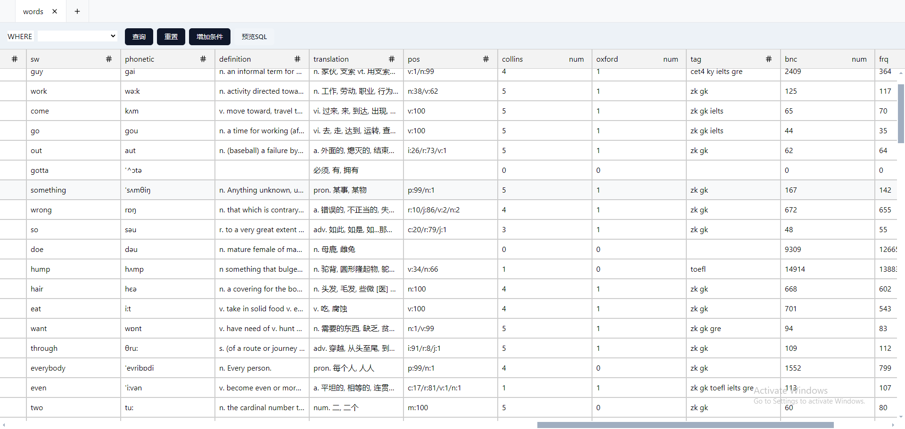

# SqliteWeb

本项目是一个 `sqlite` 数据库管理应用，在 `web` 页面可以查询 `sqlite` 数据。



## 功能

1. 使用虚拟列表，支持无限滚动
2. 支持联表查询

## 使用方式

下载可执行文件并放置到系统环境变量，然后和正常的命令一样使用
<!-- download the execuable file, and save it filepath to your system PATH, then using like other command -->

```bash
sqliteweb <database.db> --port 8000
```

打开浏览器，访问 `http://127.0.0.0:8000` 即可
<!-- open the browser, visit `http://127.0.0.0:8000` -->

## 其他

前端项目
<!-- frontend project -->
[sqlite-web-ui](https://github.com/ltaoo/sqlite-web-ui)

本项目 交互、查询时生成的 `ORM` 格式 参考了 `Prisma` 项目，感谢 [Prisma](https://github.com/prisma/prisma) 项目。
<!-- This project's interactions were inspired by Prisma. Thanks to Prisma. -->
