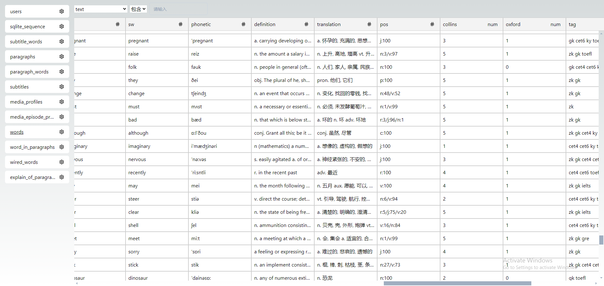

# SqliteWeb

本项目是一个 `sqlite` 数据库管理应用，在 `web` 页面可以查询 `sqlite` 数据。



## 使用方式

下载可执行文件并放置到系统环境变量，然后和正常的命令一样使用

```bash
sqliteweb -url <database.db>
```

然后打开浏览器，访问 `http://127.0.0.0:8000` 即可。

## 其他

前端项目
[sqlite-web-ui](https://github.com/ltaoo/sqlite-web-ui)
